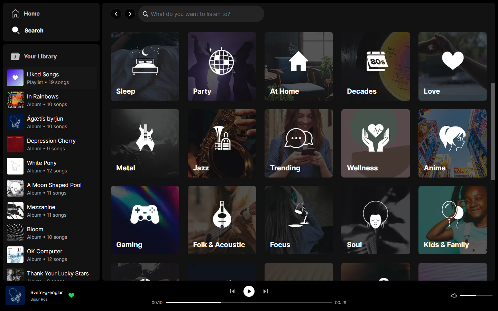

<details>
  <summary>Table of Contents</summary>
  <ul>
    <li>
      <a href="#about-the-project">About The Project</a>
      <ul>
        <li><a href="#built-with">Built With</a></li>
        <li><a href="#description">Description</a></li>
      </ul>
    </li>
    <li><a href="#getting-started">Getting Started</a></li>
  </ul>
</details>

## About The Project



### Built with

- [![Next.js][nextjs-image]][nextjs-url]
- [![TypeScript][typescript-image]][typescript-url]
- [![Sass][sass-image]][sass-url]
- [![Spotify API][spotify-api-image]][spotify-api-url]
- [![Genius API][genius-api-image]][genius-api-url]

### Description

- Using official Spotify API to get large library of tracks.
- Handling large data of albums, artists, tracks, custom playlists and more.
- Using Genius API to get lyrics for any track page.
- Includes your personal library, where you can save your favorite albums, playlist, artists and tracks.
- Custom made player that plays tracks
- Resizable sidebar.

## Getting Started

1. Clone the repository, and move to the root directory of the project

```sh
git clone https://github.com/LukaKobaidze/typing-app
```

2. Install packages

```sh
npm install
```

or

```sh
yarn install
```

3. Add environment variables for APIs (add `.env.local` file at the root directory of the project)

```sh
SPOTIFY_CLIENT_ID=<your-spotify-client-id-here>
SPOTIFY_CLIENT_SECRET=<your-client-secret-here>
GENIUS_ACCESS_TOKEN=<your-genius-access-token-here>
```

To get your personal tokens/ids mentioned above, check out these APIs official pages: <br />
https://developer.spotify.com/documentation/web-api <br />
https://genius.com/developers

4. Run the application locally

```sh
npm run dev
```

or

```sh
yarn dev
```

[nextjs-image]: https://img.shields.io/badge/next.js-000000?style=for-the-badge&logo=nextdotjs&logoColor=white
[typescript-image]: https://shields.io/badge/TypeScript-3178C6?logo=TypeScript&logoColor=FFF&style=for-the-badge
[sass-image]: https://img.shields.io/badge/Sass-CC6699?style=for-the-badge&logo=sass&logoColor=white
[spotify-api-image]: https://img.shields.io/badge/spotify%20api-1DB954?style=for-the-badge&logo=spotify&logoColor=white
[genius-api-image]: https://img.shields.io/badge/genius%20api-ffff64?style=for-the-badge&logo=genius&logoColor=black
[nextjs-url]: https://nextjs.org/
[typescript-url]: https://www.typescriptlang.org/
[sass-url]: https://sass-lang.com/
[spotify-api-url]: https://developer.spotify.com/documentation/web-api
[genius-api-url]: https://genius.com/developers
